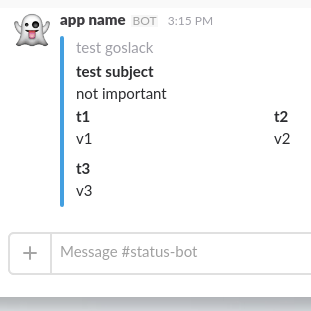

Slackhook
===========
Basic Slack incoming webhook client

[Setup web hook](https://superops.slack.com/apps/new/A0F7XDUAZ-incoming-webhooks)

Usage
===========
~~~~golang
    client := New(
            `https://hooks.slack.com/services/XXXXXXXX/XXXXXXXXXXXXXXXXXXXXXXXXXX`, 
            `http://monitor/page/`, 
            `test goslack`, 
            `app name`, 
            `:ghost:`
            )

        //client.NewMessage().Send() will send un empty message.

	fld := []Field{
                Field{Title: `t1`, Value: `v1`, Short: true}, 
                Field{Title: `t2`, Value: `v2`, Short: true}, 
                Field{Title: `t3`, Value: `v3`, Short: true}
            }

	msg := client.NewMessage().Color(`#439FE0`).Subject(`test subject`).Text(`not important`).Fields(fld)
	if err := msg.Send(); err != nil {
		log.Println(err)
	}
~~~~    

